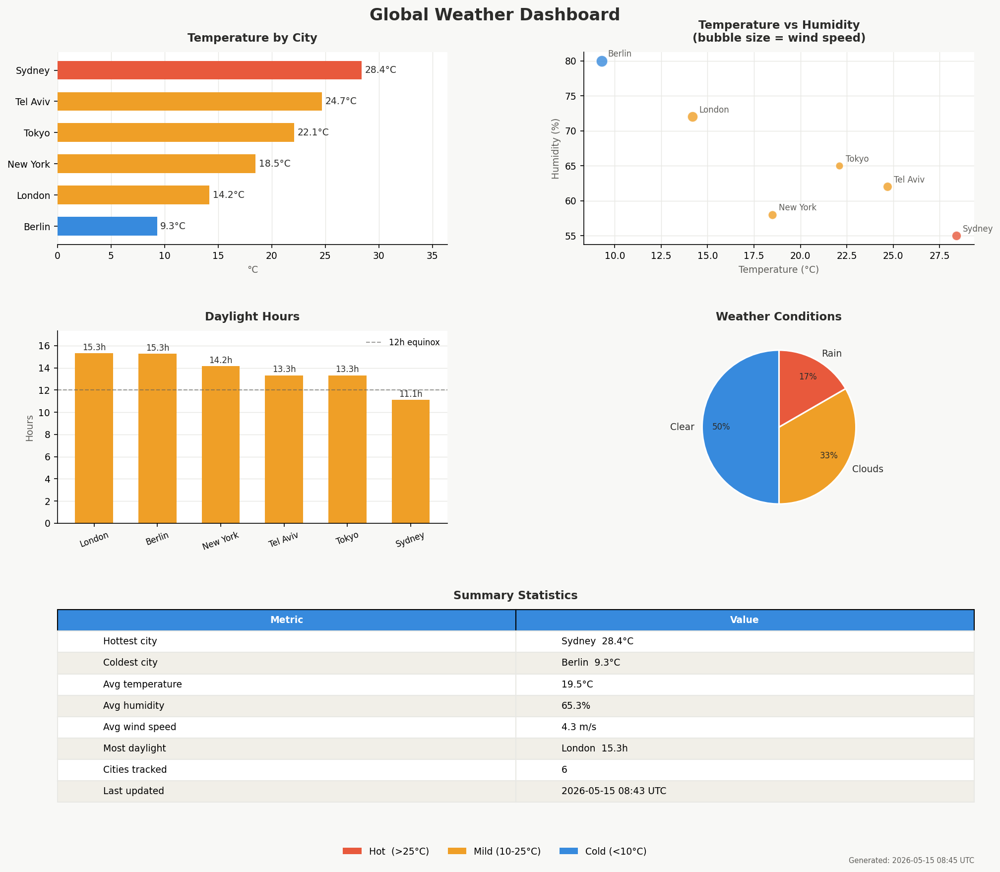

# 🌍 Weather ETL Pipeline

A end-to-end data engineering pipeline that extracts real-time weather data
from a public API, transforms and cleans it with Pandas, stores it in a
structured SQLite database, and generates an automated multi-chart dashboard.

> Built as a portfolio project demonstrating core Data Engineering skills:
> pipeline design, SQL schema modeling, data transformation, and visualization.

---

## Dashboard Preview

<!-- After you run the pipeline, take a screenshot of the PNG in data/reports/
     and replace the path below -->


---

## Pipeline Architecture

```
OpenWeatherMap API
       │
       ▼
  extract.py       ──►  data/raw/weather_raw_TIMESTAMP.json
       │
       ▼
  transform.py     ──►  data/clean/weather_clean_TIMESTAMP.csv
       │
       ▼
  load.py          ──►  data/weather.db  (SQLite)
       │
       ▼
  dashboard.py     ──►  data/reports/weather_dashboard_TIMESTAMP.png
```

Each step is fully decoupled — you can run them independently or together
via the orchestrator `pipeline.py`.

---

## Features

- **Automated extraction** from the OpenWeatherMap REST API across multiple cities
- **Robust error handling** — per-city retries, timeout handling, graceful failure logging
- **Data transformation** with Pandas: flattening nested JSON, type casting, derived columns (`daylight_hours`, `temp_category`)
- **SQL schema design** with indexes, constraints, and a `pipeline_run_log` table for monitoring
- **5-panel dashboard** auto-generated as a timestamped PNG on every run
- **Single-command execution** via `pipeline.py` with optional `--step` flag for debugging

---

## Tech Stack

| Tool | Purpose |
|---|---|
| Python 3.11 | Core language |
| Pandas | Data transformation & cleaning |
| SQLite | Local data warehouse |
| Matplotlib | Dashboard & visualizations |
| Requests | HTTP client for API calls |

---

## Project Structure

```
amazon-data-pipeline/
├── extract.py          # Step 1 — fetch from OpenWeatherMap API
├── transform.py        # Step 2 — clean & reshape with Pandas
├── load.py             # Step 3 — insert into SQLite with schema
├── dashboard.py        # Step 4 — generate multi-chart PNG report
├── pipeline.py         # Orchestrator — runs all steps in sequence
├── requirements.txt    # Python dependencies
└── data/
    ├── raw/            # Timestamped raw JSON files (gitignored)
    ├── clean/          # Timestamped clean CSV files (gitignored)
    ├── reports/        # Generated dashboard PNGs
    └── weather.db      # SQLite database (gitignored)
```

---

## Getting Started

### 1. Clone the repo

```bash
git clone https://github.com/Sujud1/amazon-data-pipeline.git
cd amazon-data-pipeline
```

### 2. Install dependencies

```bash
pip install -r requirements.txt
```

### 3. Get a free API key

Sign up at [openweathermap.org](https://openweathermap.org/api) — it's free.
Then open `extract.py` and replace:

```python
API_KEY = "your_api_key_here"
```

### 4. Run the full pipeline

```bash
python pipeline.py
```

Or run a single step:

```bash
python pipeline.py --step 1   # Extract only
python pipeline.py --step 2   # Transform only
python pipeline.py --step 3   # Load only
python pipeline.py --step 4   # Visualize only
```

---

## Database Schema

```sql
-- Main fact table
CREATE TABLE weather_readings (
    id              INTEGER PRIMARY KEY AUTOINCREMENT,
    city            TEXT    NOT NULL,
    country         TEXT,
    temp_c          REAL,
    feels_like_c    REAL,
    temp_min_c      REAL,
    temp_max_c      REAL,
    temp_category   TEXT,           -- 'Hot' | 'Mild' | 'Cold'
    humidity_pct    INTEGER,
    pressure_hpa    INTEGER,
    wind_speed_ms   REAL,
    weather_main    TEXT,
    description     TEXT,
    daylight_hours  REAL,           -- derived: sunset - sunrise
    fetched_at      TEXT NOT NULL,
    loaded_at       TEXT NOT NULL
);

-- Pipeline observability table
CREATE TABLE pipeline_run_log (
    id              INTEGER PRIMARY KEY AUTOINCREMENT,
    run_at          TEXT    NOT NULL,
    rows_loaded     INTEGER NOT NULL,
    source_file     TEXT    NOT NULL,
    status          TEXT    NOT NULL    -- 'success' | 'failed'
);
```

---

## Sample SQL Queries

```sql
-- Hottest cities right now
SELECT city, country, temp_c, description
FROM   weather_readings
ORDER  BY temp_c DESC
LIMIT  5;

-- Average humidity by temperature category
SELECT   temp_category,
         ROUND(AVG(humidity_pct), 1) AS avg_humidity,
         COUNT(*)                    AS city_count
FROM     weather_readings
GROUP BY temp_category;

-- Pipeline run history
SELECT run_at, rows_loaded, status
FROM   pipeline_run_log
ORDER  BY run_at DESC;
```

---

## Key Engineering Decisions

**Why SQLite instead of a cloud database?**
SQLite makes the project fully self-contained and runnable offline. The schema
is designed to be portable — swapping SQLite for PostgreSQL or AWS RDS requires
changing only the connection string in `load.py`.

**Why timestamped output files?**
Every raw and clean file is timestamped so no run overwrites a previous one.
This mirrors how production data lakes store immutable snapshots of raw data.

**Why a `pipeline_run_log` table?**
Production pipelines need observability. The log table tracks every run's
status, row count, and source file — making it easy to debug failures or
audit data lineage.

**Why decouple the steps?**
Each of the 4 files (`extract.py`, `transform.py`, `load.py`, `dashboard.py`)
can run independently. This makes the pipeline easier to test, debug, and
extend — for example, swapping in a different data source only requires
changing `extract.py`.

---

## Possible Extensions

- [ ] Schedule the pipeline with Apache Airflow or cron
- [ ] Add more cities or swap to a different API (air quality, finance)
- [ ] Export dashboard to PDF and email it automatically
- [ ] Store data in AWS S3 + query with Amazon Athena
- [ ] Add data quality checks (e.g. reject rows where temp > 100°C)
- [ ] Build an interactive web dashboard with Streamlit

---

## Author

**Sujud Alatrash**
Computer Science Student — Ben Gurion University of the Negev

[LinkedIn](https://linkedin.com/in/sujud-alatrash-aa2805363) · [Portfolio](https://sujud1.github.io/portfolio/) · [GitHub](https://github.com/Sujud1)